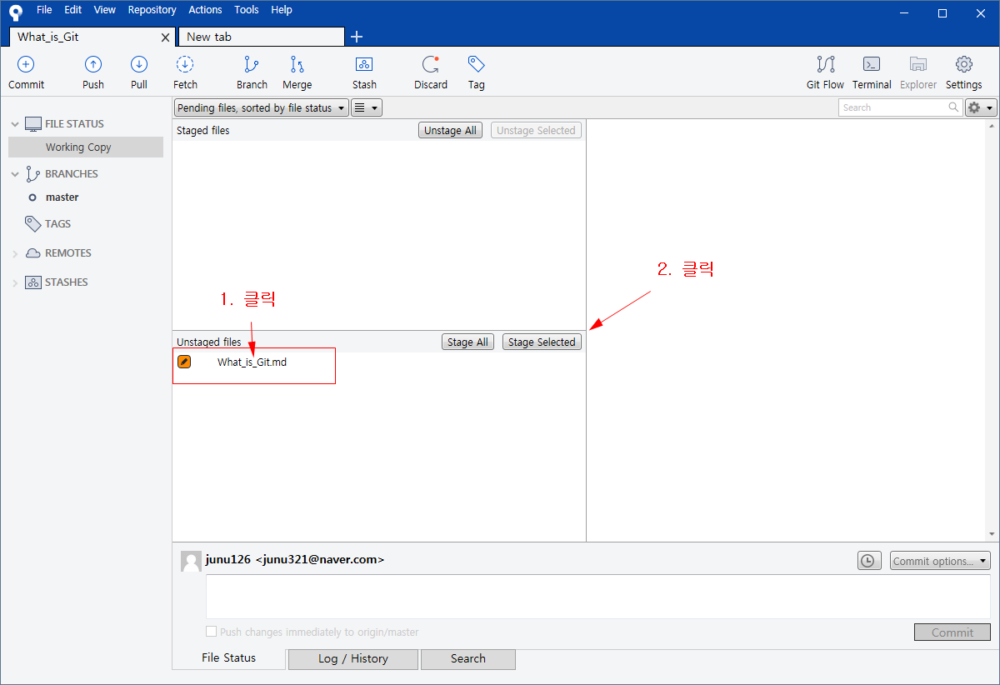

# Git을 소개합니다

## Git이란?
    
소스코드 관리를 위한 **버전관리시스템**입니다.  

하지만 '분산'의 기능이 있어서 **분산버전관리시스템**이 더 적절한 표현이라고 할 수 있습니다.  

### <pre><code> 버전관리시스템 이란?
 ++파일의 변화를 시간에 따라 기록했다가, 이후에 특정한 상태의 시점으로 버전을 되돌릴 수 있게 해주는 시스템++</code></pre>
 
### <pre><code>소스코드 란?  
++컴퓨터 프로그램을 사람이 읽을 수 있는 프로그래밍 언어로 적은 글++</code></pre>

## Git을 왜 사용하는가?  

Git을 사용하는 이유에는 여러가지가 있지만 세 가지 만 예로 들어보겠습니다. 

먼저 첫째로,**Git은 팀프로젝트를 진행하는데 있어 엄청난 도움을 줍니다**.    

>> 상황을 가정해 봅시다.    

>>만약 각자 다른나라에서 4명의 개발자가 하나의 프로젝트를 진행한다고 할때, 역할을 나눠서 진행을 할 것 입니다.    

>>그리고 맡은 역할을 해 나가면서 프로젝트는 서서히 완성되가겠지요.    

>>하지만 중간에 문제가 생깁니다.    

>>개개인이 작업한 내용이 그들의 로컬저장소에 저장되기 때문에 작업한 내용을 합치지도 못하고, 확인도 못하는 상황이 된겁니다.    

>>하지만, 이 상황에서 Git이 있다면 그들의 작업내용을 로컬저장소에서 모두가 공동으로 이용가능한 원격저장소로 Push가 가능하기에    

>>모두의 작업내용을 확인할 수 있고, 합쳐볼 수도 있는 것 입니다.   

또, 두번째로는**로컬저장소에 있던 데이터들이 폭발해도, 원격저장소를 통해 복구할 수 있습니다**.   

마지막으로는**branch와 Merge를 이용한 실험적인 작업 또한 할 수 있습니다**.    

>>먼저 branch(브랜치)가 무엇인지 설명을 드리겠습니다.    

>>브랜치는 Git에 포함된 기능중 정말 획기적인 기능입니다.    

>>상황을 가정해봅시다.    

>>만약 프로젝트 작업을 진행하는데**안정적이지 않은**작업을 해야합니다.    

>>불안한 마음으로 작업을 해야할 것입니다. 만약 성공적으로 진행되지 않는다면 결과는...    

>>이러한 상황에서 사용하는 것이 바로 브랜치와 Merge(병합)입니다.    

>>브랜치 기능을 사용하면 기존에 하던 안정적인작업과 안정적이지 않은 작업을 따로 저장할 수 있게됩니다.    

>>마치 하나의 나무에 여러 가지가 생기는 것 처럼 말이죠.    

>>그리고 안정적이지 않은 작업이 성공적으로 마친다면 Merge기능을 사용하여 다시 합치면 되고, 그렇지 않다면 과감하게 버리면 됩니다.   

## Git과 Github의 차이  
 
Git과 Github은 땔 수 야 땔 수 없는 사이입니다.   

Github는 Git을 사용하는 사람들을 위한 웹을 기반으로한 호스팅 서버스입니다.  

Github는 Git의 사용자에게 저장소와 협업 공간 등을 제공해줍니다.  

 또한 Git 명령어를 사용하여 Github가 제공하는 원격저장소에 연결하고 관리할 수 있습니다.    
 
### <pre><code>웹 호스팅 서비스 란?
인터넷 호스팅 서비스의 일종으로, 개인이나 단체가 월드 와이드 웹을 통해 웹사이트를 제공하는 것</code></pre> 

>>(인터넷 호스팅 서비스란, 인터넷 서버를 운영하는 서비스로, 단체와 개인이 콘텐츠를 인터넷에 제공하는 것을 도와준다.)  

>>(월드 와이드 웹 이란, 인터넷에 연결된 컴퓨터들을 통해 사람들이 정보를 공유할 수 있는 전세계쩍인 정보 공간.)  

## Git을 사용하는 기본적인 flow  

Git에는 여러 개념들이 존재합니다. 대표적인 개념들을 소개하겠습니다.  

* **Commit** : 게임의 세이브에 해당하는 행동을 git에서는 커밋이라고 합니다. 커밋을 하기 위해선 저장을 원하는 파일들을 묶어서 커밋 명령을 수행하면 됩니다.  

* **Add** : 앞에서 커밋을 하기전에 저장을 원하는 파일들을 묶는 일을 해야한다고 했습니다. Add가 저장을 원하는 파일들을 묶는 일을 합니다. 이 작업을 스테이지에 파일을 올린다라고 합니다.  

* **Push** : 커밋을 하면 이제 현재 작업 내용의 세이브 데이터가 내 컴퓨터에 저장됩니다. github에 업로드 하는 걸 git에서는 push라고 합니다.  

Github를 사용하는 방법에는 여러가지가 있습니다.  

>>첫번째로, 명령어를 사용하는 방법이 있고,  

>>두번째론, 개발되어 있는 클라이언트들을 사용하는 방법입니다.  

저는 두번째 방법을 선택해서 공부했습니다. 클라이언트를 사용하는 것이 명령어로 사용하는 것 보다 쉽다고 생각했기 때문입니다.  

제가 소개할 클라이언트는 "소스트리(Source tree)"라고 합니다.  

소스트리를 이용해서 Git을 사용 하는 과정을 알려드리겠습니다.

   * Github홈페이지에서 회원가입을 한다. https://github.com/  

   * 회원가입을 하고, 저장소를 만듭니다. 저장소는 new repository버튼을 눌러서 만들 수 있습니다. // (Repository name에 저장소 이름을, Description에 무엇을 공부할 것인가를, Public에 체크를 하셔야 공개가 됩니다. 그리고 Initialize this repository with a README에 체크 해주세요.)  

   * Source Tree를 설치합니다. https://www.sourcetreeapp.com/  

   * SourceTree에서 Github에서 만든 저장소를 clone해 가져옵니다. // (Github에서 만들었던 저장소의 URL을 복사해서 Source path / URL: 에 넣으시면 됩니다.)  

   * 지금까지 순서를 모두 마치면 프로그래밍 작업을 합니다. 물론 저장은 Clone 해온 폴더에 저장합니다. // (문서에 Clone해온 저장소의 이름으로 폴더가 있습니다.)  

   * 작업을 끝 마치고 github에 업로드 할때 에는 Sourcetree에서 원하는 파일을 체크한 후 Stage Selected를 눌러서 Add 합니다.)  
   
   *   

   * Add를 하고 아래의 Commit을 눌러 커밋을 합니다.  

   * Push를 눌러서 github에 업로드 합니다.  

   * Github에 들어가서 확인합니다.  

## +추가 사항

* 상민이형의 숙제는 실패했따.